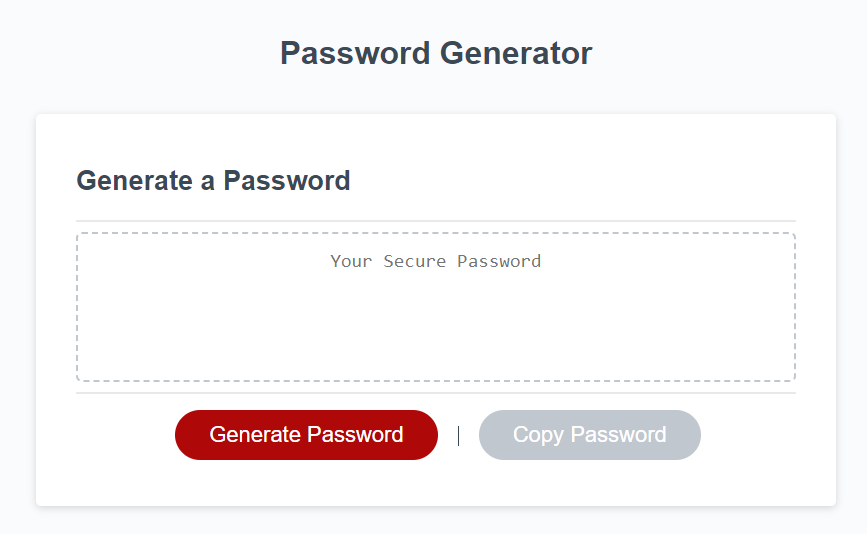
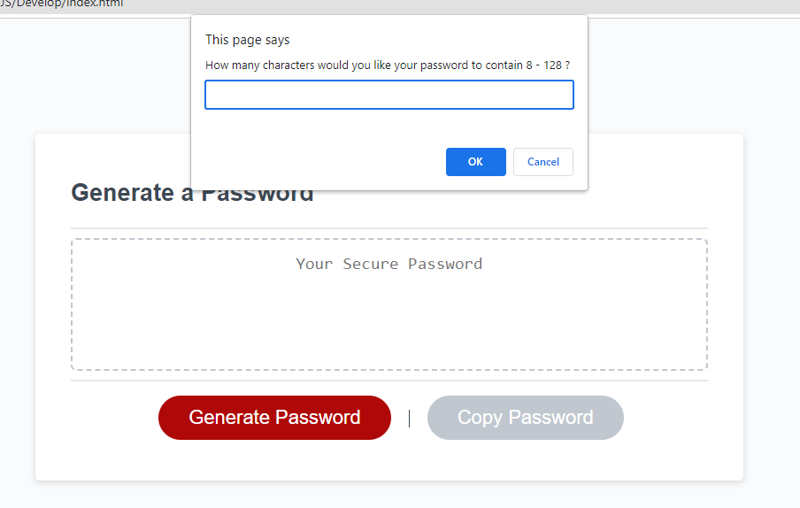
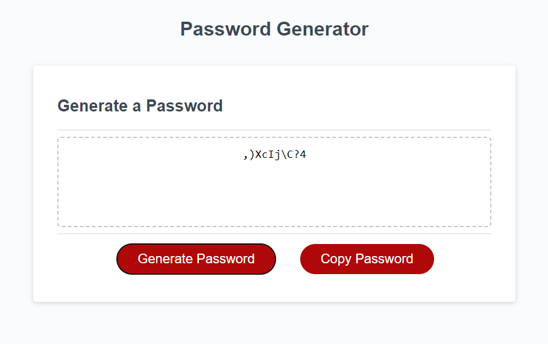

# Password-Generator-JS

## Portfolio Website
This repository contains the code and assets for Password Generator Tool that was created by me. When using the website the customers will be able to generate random password based on what criteria they have selected.
All password are randomly created and not stored on any DB.
This project is mainly focused on showing up my skills in JS and HTML coding, and to improve on it as I progress through my learning journey.

## GitHub Repo URL
https://github.com/AllenHirmiz/Password-Generator-JS

## Website URL
https://allenhirmiz.github.io/Password-Generator-JS/Develop/

## Table of Contents
Header
Password box
Generate Password button
Copy Password button

Generate Password site is designed to provide an easy way to the customer to generate a unique and random password based on their needs.

## Installation
Web Based
## Technologies Used
The portfolio website is built using the following technologies:

HTML5: The structure and layout of the web pages.
CSS3: Styling and visual enhancements for an appealing user interface.
JavaScript: Dynamic and interactive elements, such as animations and form validation.
Git: Version control system for managing codebase changes.
GitHub Pages: Hosting service for deploying the website.
## Mock-Up

The following image shows the web application's appearance and functionality:

## Customer will be presented with 2 button, and only one button is clickable to all them to generate a custom password based on their criteria. 

## When Generate Password is clicked, the customer will be presented with a few pop-up messages to advise the password length and strength.

## Once the password is generated, the customer will now be able to copy the password by clicking Copy Password button

